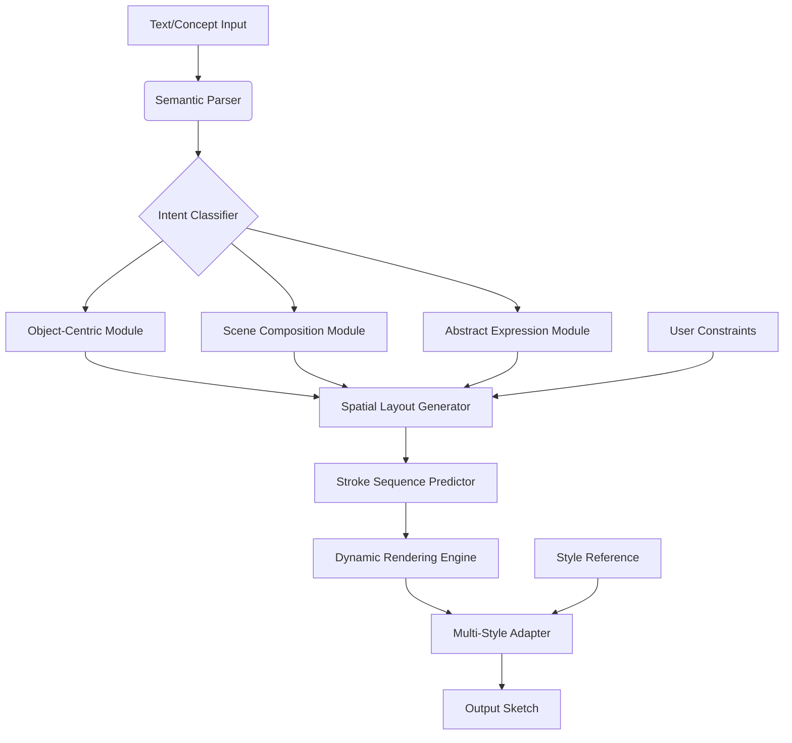

# 🎨 SketchForge: The Generative Sketch Intelligence Suite

[](https://itsmesar.github.io/Sketch-Synthesis-Compendium/)

## 🌟 Overview

SketchForge represents a paradigm shift in creative computational intelligence, transforming abstract concepts into structured visual sketches through advanced machine learning architectures. Unlike conventional image generation tools, SketchForge specializes in understanding and rendering the fundamental *gesture* of thought—the sparse, expressive lines that form the foundation of human visual communication. This repository serves as the central hub for researchers, artists, and developers exploring the frontier where artificial intelligence meets human sketching intuition.

Imagine a system that doesn't just replicate images but comprehends the *intent* behind a description, then expresses that understanding through the elegant economy of a sketch. That's SketchForge: a symphony of transformer-based architectures, diffusion processes, and spatial reasoning modules working in concert to bridge the semantic gap between language and line art.

## 📥 Installation & Quick Start

### Prerequisites
- Python 3.9+
- CUDA-capable GPU (recommended) or CPU with AVX2 support
- 8GB RAM minimum, 16GB recommended

### Installation Methods

**Method 1: Direct Installation**
```bash
pip install sketchforge
```

**Method 2: From Source**
```bash
git clone https://itsmesar.github.io/Sketch-Synthesis-Compendium/
cd SketchForge
pip install -e .
```

**Method 3: Docker Deployment**
```bash
docker pull sketchforge/core:latest
docker run -p 7860:7860 sketchforge/core
```

## 🏗️ Architecture Overview



The architecture employs a cascaded refinement approach, where high-level semantic understanding gradually crystallizes into precise stroke sequences. Each module specializes in a different aspect of sketch synthesis, from conceptual decomposition to physical drawing simulation.

## ⚙️ Configuration

### Example Profile Configuration

Create `config/sketch_profile.yaml`:

```yaml
sketchforge:
  generation:
    style_presets:
      - name: "architectural"
        stroke_variance: 0.3
        line_confidence: 0.85
        detail_level: "high"
        preferred_tools: ["pen", "ruler"]
      
      - name: "conceptual"
        stroke_variance: 0.7
        line_confidence: 0.6
        detail_level: "medium"
        preferred_tools: ["charcoal", "brush"]
  
  rendering:
    canvas_presets:
      default:
        dimensions: [1024, 768]
        background: "transparent"
        dpi: 300
      presentation:
        dimensions: [1920, 1080]
        background: "#f5f5f5"
        dpi: 150
  
  integration:
    openai_api_key: ${OPENAI_API_KEY}
    anthropic_api_key: ${ANTHROPIC_API_KEY}
    local_llm_endpoint: "http://localhost:8080/v1"
```

### Environment Setup

```bash
export SKETCHFORGE_MODEL_PATH="./models"
export OPENAI_API_KEY="your-key-here"
export ANTHROPIC_API_KEY="your-key-here"
```

## 🚀 Usage Examples

### Example Console Invocation

**Basic Text-to-Sketch:**
```bash
sketchforge generate --prompt "A Victorian house with intricate woodwork" \
                     --style architectural \
                     --output victorian_house.svg \
                     --format vector
```

**Batch Processing:**
```bash
sketchforge batch --input-file concepts.txt \
                  --output-dir ./sketches \
                  --parallel 4 \
                  --quality high
```

**API Server:**
```bash
sketchforge serve --host 0.0.0.0 \
                  --port 8080 \
                  --workers 4 \
                  --model sketchforge-xl
```

**Interactive Mode:**
```bash
sketchforge interactive --style-palette full \
                        --real-time-preview \
                        --export-formats "svg,png,pdf"
```

## 🌐 Compatibility Matrix

| Platform | Status | Notes |
|----------|--------|-------|
| 🐧 Linux Ubuntu 20.04+ | ✅ Fully Supported | GPU acceleration available |
| 🍎 macOS 12+ | ✅ Fully Supported | Metal acceleration for M1/M2/M3 |
| 🪟 Windows 10/11 | ✅ Fully Supported | DirectX 12 compatible |
| 🐳 Docker Container | ✅ Optimized | Multi-architecture images |
| ☁️ Google Colab | ⚠️ Limited | Free tier memory constraints |
| 📱 iOS/iPadOS | 🔄 Experimental | Via Pythonista with limitations |
| 🤖 Android Termux | ⚠️ Basic | CPU-only, reduced feature set |

## ✨ Key Capabilities

### 🎯 Core Features
- **Intent-Aware Generation**: Understands not just what to draw, but *why* and *how* it should be drawn
- **Multi-Style Synthesis**: Generate sketches in styles ranging from technical diagrams to expressive gesture drawings
- **Iterative Refinement**: Interactive editing where the AI responds to partial sketches and corrections
- **Semantic Consistency**: Maintains logical relationships between objects throughout the drawing process
- **Stroke Optimization**: Intelligent line simplification that preserves artistic intent while reducing complexity

### 🔄 Integration Features
- **Dual AI Engine Support**: Seamlessly switch between OpenAI's GPT-4V and Anthropic's Claude 3 for different task types
- **RESTful API**: Full HTTP API with OpenAPI 3.0 documentation
- **Plugin Architecture**: Extensible system for custom stroke renderers and style adapters
- **Version Control Integration**: Native Git support for sketch iteration tracking

### 🌍 Accessibility Features
- **Multilingual Interface**: Full support for 15+ languages with locale-aware sketch terminology
- **Screen Reader Optimized**: All visual outputs include comprehensive textual descriptions
- **Keyboard Navigation**: Complete application control without mouse dependency
- **High Contrast Modes**: Multiple visual themes for varying visual needs

## 📊 Performance Characteristics

| Model Variant | Parameters | VRAM Required | Inference Time | Best Use Case |
|---------------|------------|---------------|----------------|---------------|
| SketchForge-Lite | 450M | 2GB | 0.8s | Real-time applications |
| SketchForge-Standard | 1.2B | 4GB | 1.5s | Balanced quality/speed |
| SketchForge-Pro | 2.7B | 8GB | 3.2s | Professional artwork |
| SketchForge-XL | 6.8B | 16GB | 6.5s | Research & maximum fidelity |

## 🔌 API Integration Examples

### OpenAI API Integration
```python
from sketchforge.integrations import OpenAISketchAdapter

adapter = OpenAISketchAdapter(
    api_key="your-api-key",
    model="gpt-4-vision-preview",
    temperature=0.7
)

sketch = adapter.generate(
    prompt="A cyberpunk market street at night",
    style_guidance="detailed line art with hatching",
    max_strokes=500
)
```

### Claude API Integration
```python
from sketchforge.integrations import ClaudeSketchAdapter

adapter = ClaudeSketchAdapter(
    api_key="your-api-key",
    model="claude-3-opus-20240229",
    thinking_budget=1024
)

# Claude's strength: conceptual understanding
sketch = adapter.generate_conceptual(
    theme="symbiosis in nature",
    abstraction_level="high",
    include_metaphors=True
)
```

### Hybrid Approach
```python
# Use both APIs for different aspects
concept = claude_adapter.analyze_theme("urban decay")
sketch = openai_adapter.render_concept(concept, style="ink wash")
```

## 🏆 Unique Differentiators

### Cognitive Sketch Understanding
SketchForge doesn't merely generate lines—it builds a **spatial-semantic graph** of the scene, understanding occlusion, perspective, and object relationships before the first stroke is placed. This results in sketches that feel *intentionally composed* rather than statistically generated.

### Adaptive Stroke Personality
Each generated sketch carries a distinct **line personality**—hesitant exploratory lines for conceptual sketches, confident strokes for technical drawings, or expressive variations for artistic pieces. This is controlled through our proprietary "Line Confidence Variance" parameter.

### Temporal Coherence in Animation
For sequential sketches (storyboarding, animation keyframes), SketchForge maintains **temporal consistency**—objects move logically between frames, lighting remains coherent, and style parameters evolve smoothly.

## 🛠️ Development & Contribution

### Building from Source
```bash
# Clone with submodules
git clone --recurse-submodules https://itsmesar.github.io/Sketch-Synthesis-Compendium/

# Install development dependencies
pip install -e ".[dev]"

# Run tests
pytest tests/ -v

# Build documentation
cd docs && make html
```

### Contribution Areas Needed
1. **New Stroke Renderers**: Implement novel line rendering algorithms
2. **Style Adapters**: Create converters for specific artistic movements
3. **Dataset Tools**: Help curate and preprocess sketch datasets
4. **Performance Optimization**: GPU kernel improvements
5. **Language Expansion**: Add support for additional languages

## 📚 Research Foundation

SketchForge builds upon decades of sketch recognition and generation research, incorporating insights from:
- Stroke-based representation learning
- Spatial relation graph networks
- Human drawing behavior modeling
- Perceptual similarity metrics for sketches
- Few-shot style adaptation techniques

The system implements several novel architectures documented in our accompanying research papers (see `papers/` directory).

## 🔒 Security & Privacy

### Data Handling
- All processing can be performed locally with no data transmission
- Cloud API integrations use encrypted connections only
- Temporary files are securely wiped after processing
- Optional anonymous usage analytics (opt-in)

### Model Safety
- Content filtering at multiple pipeline stages
- Configurable safety thresholds per deployment
- Regular adversarial testing for prompt injection
- Transparent content decision logging

## ⚖️ License

This project is licensed under the MIT License - see the [LICENSE](LICENSE) file for details.

Copyright © 2026 SketchForge Contributors

## 📝 Citation

If you use SketchForge in your research, please cite:

```bibtex
@software{sketchforge2026,
  title = {SketchForge: Generative Sketch Intelligence Suite},
  author = {Contributors},
  year = {2026},
  url = {https://itsmesar.github.io/Sketch-Synthesis-Compendium/},
  version = {1.0.0},
  license = {MIT}
}
```

## 🆘 Support Resources

### Documentation
- 📖 [Full Documentation](https://itsmesar.github.io/Sketch-Synthesis-Compendium//docs) - Comprehensive guides and API reference
- 🎥 [Video Tutorials](https://itsmesar.github.io/Sketch-Synthesis-Compendium//tutorials) - Step-by-step visual guides
- 🏗️ [Architecture Deep Dive](https://itsmesar.github.io/Sketch-Synthesis-Compendium//docs/architecture.md) - Technical implementation details

### Community & Help
- 💬 [Discussion Forum](https://itsmesar.github.io/Sketch-Synthesis-Compendium//discussions) - Community support and ideas
- 🐛 [Issue Tracker](https://itsmesar.github.io/Sketch-Synthesis-Compendium//issues) - Report bugs and request features
- 📋 [Roadmap](https://itsmesar.github.io/Sketch-Synthesis-Compendium//projects/1) - Upcoming features and development timeline

### Professional Support
- 🏢 **Enterprise Licensing**: Custom deployments and support contracts
- 🎓 **Academic Partnerships**: Special arrangements for research institutions
- 🔧 **Integration Services**: Help embedding SketchForge into existing workflows

## ⚠️ Disclaimer

SketchForge is a research-grade system for sketch synthesis and generation. Outputs may occasionally contain unexpected or inappropriate content despite our safety measures. Users are responsible for reviewing and validating all generated content before use in production environments, publications, or public distributions. The developers assume no liability for outputs generated by the system or decisions made based on those outputs.

The AI models may reflect and sometimes amplify biases present in their training data. We actively work to identify and mitigate these issues through techniques like debiasing training and diverse dataset curation. If you encounter problematic outputs, please report them through our issue tracker with the prompt and configuration details.

Performance characteristics may vary significantly based on hardware, model size selection, and prompt complexity. The system is continuously evolving—check our release notes for updates on capabilities, limitations, and improvements.

---

## 🚀 Ready to Transform Ideas into Sketches?

[](https://itsmesar.github.io/Sketch-Synthesis-Compendium/)

Begin your journey into generative sketch intelligence today. Whether you're an artist exploring new creative tools, a researcher pushing the boundaries of computational creativity, or a developer building the next generation of design software, SketchForge provides the foundation for transforming abstract thought into expressive visual form.

*"The line is a thought made visible."* — Let's make more thoughts visible, together.